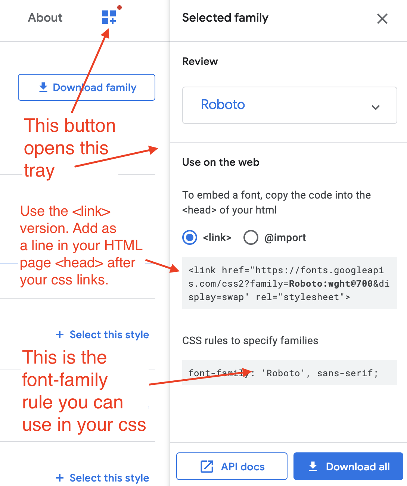

# Using Google Fonts

Using Google Fonts used to be more intuitive than it seems to be now. This is a super quick primer on how do to it.

- Go to [Google Fonts](https://fonts.google.com/).
- Browse or search for a font you want.
- Click on the font page so you can see all the styles available.
- Click on the **+ Select this style** link to add the font to your selections.


- Repeat this for all the font and font styles you want, but be selective. Don't choose fonts you won't use, and don't use too many. (Each font increases your page size, slowing down your site.)
- Once you have selected all your fonts, if the tray on the right is not open already, click on the box-like icon at the top right to open it.



- All your selected fonts will be rolled together into one `<link>` line. Copy that line and put it on each HTML page (or template) that will use the fonts.
- The CSS rule shown below that shows you how to write each individual font as part of a style rule. Realize this is just _part_ of the style rule. If you want to apply this Roboto font to all H1 elements, you would write in your CSS like this:

```css
h1 {
  font-family: 'Roboto', sans-serif;
}
```
